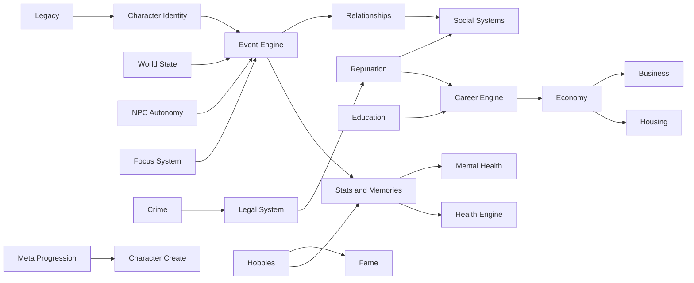
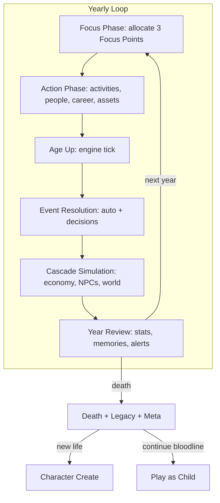
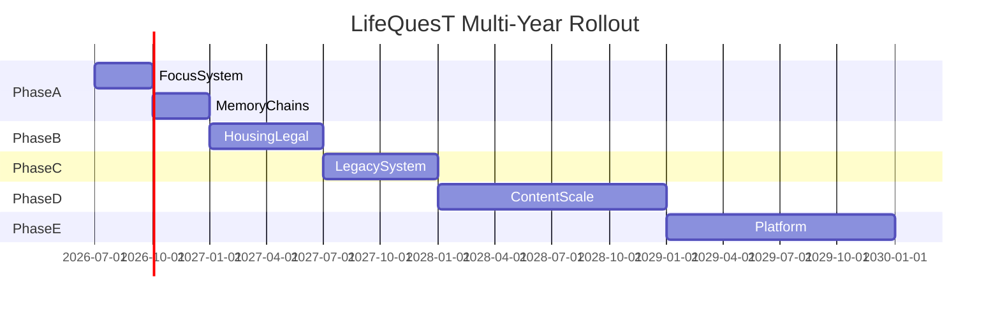

# LifeQuesT — Complete Game Design Rollout

**Version:** 1.0  
**Status:** Team Blueprint  
**Last Updated:** June 2026  
**Audience:** Design, Engineering, Content, Product, Monetization

**Related docs:** [PROJECT_VISION.md](workflows/PROJECT_VISION.md) · [ARCHITECTURE.md](workflows/ARCHITECTURE.md) · [ENGINE_WORKFLOW.md](workflows/ENGINE_WORKFLOW.md)

**Current baseline:** 15 domain engines, ~530 events, 92 careers, 15 traits, 12 achievements, yearly age-up loop, reincarnation stat-carry.

**Design north star:** *Every life is a strategy RPG disguised as a story generator.*

---

## Table of Contents

1. [Executive Vision](#1-executive-vision)
2. [System Interaction Map](#2-system-interaction-map)
3. [Core Loop: Focus + Yearly Tick](#3-core-loop-focus--yearly-tick)
4. [Character System](#4-character-system)
5. [Family & Legacy System](#5-family--legacy-system)
6. [Education System](#6-education-system)
7. [Career System](#7-career-system)
8. [Economy System](#8-economy-system)
9. [Relationships & NPC System](#9-relationships--npc-system)
10. [Social Systems](#10-social-systems)
11. [Crime & Legal System](#11-crime--legal-system)
12. [Health System](#12-health-system)
13. [Lifestyle & Hobbies](#13-lifestyle--hobbies)
14. [Housing, Vehicles & Pets](#14-housing-vehicles--pets)
15. [Fame System](#15-fame-system)
16. [Business System](#16-business-system)
17. [World Events Engine](#17-world-events-engine)
18. [Random Event Engine](#18-random-event-engine)
19. [Legacy & Meta Progression](#19-legacy--meta-progression)
20. [Behavioral Psychology Framework](#20-behavioral-psychology-framework)
21. [Ethical Monetization Catalog](#21-ethical-monetization-catalog)
22. [Multi-Year Development Rollout](#22-multi-year-development-rollout)
23. [Phase A Engineering Spec](#23-phase-a-engineering-spec)
24. [Event Chain Catalog](#24-event-chain-catalog)
25. [Content Scale Taxonomies](#25-content-scale-taxonomies)
26. [UI Screen Map](#26-ui-screen-map)
27. [Engine Module Map](#27-engine-module-map)
28. [Content Authoring Pipeline](#28-content-authoring-pipeline)
29. [Success Metrics](#29-success-metrics)
30. [Appendix: Gap Matrix](#30-appendix-gap-matrix)

---

## 1. Executive Vision

### 1.1 Why LifeQuesT Exists

BitLife proves mobile life sims have massive appetite. Its strengths are **low friction**, **comedic randomness**, and **completionist hooks**. Its weaknesses are **shallow causality**, **stat inflation without meaning**, **NPCs as props**, and **lives that feel interchangeable after 20 hours**.

LifeQuesT wins by making players feel: *"This life only happened because of choices I made years ago."*

LifeQuesT is **not** a BitLife clone. BitLife is a benchmark. We learn why its systems retain players, then build superior alternatives that reward strategy, emotional investment, and generational storytelling.

### 1.2 Design Pillars

Every feature must serve at least one pillar.

| Pillar | Player Question | LifeQuesT Answer |
|--------|-----------------|------------------|
| **Consequence Depth** | Why does this choice matter in 10 years? | Memory chains, delayed flags, NPC grudges |
| **Strategic Identity** | Who am I building? | Focus system, aspirations, skill trees |
| **Living World** | Does the world react without me? | NPC autonomy, macro events, rival systems |
| **Emotional Bonds** | Who do I care about? | Relationship arcs, pet bonds, family drama |
| **Generational Story** | Why start another life? | Legacy tree, inherited businesses, genetic arcs |
| **Discovery** | What haven't I seen? | Hidden careers, secret events, rare trait combos |
| **Mastery** | What am I getting better at across lives? | Meta museum, prestige, challenge modes |

### 1.3 BitLife Reference Analysis

| BitLife Strength | Why It Works | LifeQuesT Superior Alternative |
|------------------|--------------|-------------------------------|
| One-tap age-up | Dopamine cadence | **Focus Phase** adds strategy without killing pace |
| Random events | Surprise, shareability | **Weighted narrative chains** shaped by player history |
| Job list + promotions | Clear progression | **Career skill trees + workplace politics** |
| Relationship meters | Simple social loop | **NPC memory + autonomous goals + jealousy/loyalty** |
| Crime → prison | Risk/reward drama | **Full legal pipeline**: investigation → trial → parole |
| Royalty / fame | Fantasy aspiration | **Fame tiers with scandal economy** tied to social systems |
| Achievements | Completion drive | **500+ achievements + Life Museum + generational trophies** |
| God Mode / IAP | Convenience revenue | **Ethical depth unlocks**: cosmetic, convenience, content packs |

### 1.4 Player Retention Questions

Every system must answer at least one:

| Question | Design Response |
|----------|-----------------|
| Why come back tomorrow? | Daily quests, weekly challenges, seasonal world states |
| Why start another life? | Unseen builds, dynasty continuation, challenge modes |
| Why recommend this game? | Shareable life summaries, rare story moments |
| Why spend 500 hours? | Mastery trees, collections, generational sagas |
| Why purchase premium? | Convenience, cosmetics, narrative depth — never power |

---

## 2. System Interaction Map



### 2.1 Cross-System Rule: Memory Tags

No meaningful stat change is silent. Every consequential action writes a **Memory Tag** to `memories[]` or `traumaMemories[]` on the `Character` type (`src/types/index.ts`). Future events, NPCs, and eligibility checks reference these tags.

Memory tag format: `{ category, id, age, intensity, expiresAt? }`

Examples: `betrayed_best_friend`, `survived_car_crash`, `won_state_championship`, `bankruptcy_2019`

### 2.2 Dependency Priority

When two systems conflict, resolve in this order:

1. **Death / legal incapacitation** (jail, coma)
2. **World macro events** (pandemic, war)
3. **Financial insolvency** (bankruptcy triggers)
4. **Relationship crises** (divorce, custody)
5. **Career / education gates**
6. **Optional lifestyle events**

---

## 3. Core Loop: Focus + Yearly Tick

### 3.1 Purpose

Replace one-click progression with **meaningful yearly planning** while preserving mobile-friendly session length.

### 3.2 Gameplay Loop



### 3.3 Internal Logic: Focus System

**Focus Points:** 3 per year (2 during ages 0–12 with auto-allocation; full player control at 13+).

**Focus Domains:**

| Domain | Primary Effect | Secondary Effect |
|--------|----------------|------------------|
| **Career** | +25% promotion/performance event weight | +15% career skill XP |
| **Education** | +20% GPA gain; study event weight | +10% scholarship eligibility |
| **Health** | -15% disease risk; +10% fitness gain | +mental health recovery rate |
| **Social** | +20% relationship interaction success | +15% new NPC introduction rate |
| **Finance** | +10% investment returns; savings events | +5% raise probability |
| **Hobby** | +30% hobby XP | +10% competition event weight |
| **Crime** | +20% crime opportunity events | +15% detection risk if active |
| **Family** | +25% family event weight | +10% fertility/partner events |

**Stacking:** Multiple points in one domain stack additively up to 2 points max per domain per year. Third point must go elsewhere.

**Auto-allocation (childhood):** Derived from family background + parent NPC priorities.

### 3.4 Focus Point Economy (Exact Modifiers)

| Domain | Event Weight Mod | Stat/XP Mod | Special |
|--------|------------------|-------------|---------|
| Career (1 pt) | ×1.25 career events | +5 performance | Boss favor +3 |
| Career (2 pt) | ×1.50 | +12 performance | Promotion roll +8% |
| Education (1 pt) | ×1.20 edu events | +0.05 GPA/year | Teacher favor +5 |
| Education (2 pt) | ×1.40 | +0.12 GPA/year | Exam pass +10% |
| Health (1 pt) | ×1.15 health events | +3 fitness, +2 health | Disease resist +5% |
| Health (2 pt) | ×1.30 | +8 fitness, +5 health | Disease resist +12% |
| Social (1 pt) | ×1.20 social/rel events | +4 social stat | Interaction +8% |
| Social (2 pt) | ×1.40 | +10 social stat | Interaction +18% |
| Finance (1 pt) | ×1.15 financial events | Investment +3% | Expense -2% |
| Finance (2 pt) | ×1.30 | Investment +8% | Side income event +15% |
| Hobby (1 pt) | ×1.25 hobby events | +15 hobby XP | Competition unlock |
| Hobby (2 pt) | ×1.55 | +35 hobby XP | Sponsorship chance +5% |
| Crime (1 pt) | ×1.20 crime events | — | Detection +8% |
| Crime (2 pt) | ×1.45 | — | Detection +18%; heat +10 |
| Family (1 pt) | ×1.25 family events | +5 happiness | Partner event +10% |
| Family (2 pt) | ×1.50 | +12 happiness | Pregnancy/child +15% |

### 3.5 Long-Term Progression

- Ages 0–12: Focus auto-set; tutorial explains at 13.
- Ages 13–25: Full control; education/career focus most impactful.
- Ages 26–55: Career/family/finance tradeoffs peak.
- Ages 56+: Health focus increasingly critical; legacy events rise.

### 3.6 Replayability

Different focus strategies create different lives from the same starting character: grind career vs. social butterfly vs. criminal empire.

### 3.7 Emotional Impact

Year Review screen summarizes "What mattered this year" — highlights relationship changes, memory tags created, near-misses.

### 3.8 Monetization

Premium subscribers get **Focus Presets** (save/load 3 focus templates) — convenience only.

### 3.9 Future Expansion

Seasonal "Focus Challenges" — e.g., "Health Only Year" for achievement hunters.

---

## 4. Character System

### 4.1 Purpose

Character is the strategic identity card—not a stat sheet. Genetics, personality, and hidden traits create **build variety** and **emergent story bias**.

### 4.2 Gameplay Loop

1. **Creation:** Roll/adjust genetics (DNA + Big Five), pick 2 surface traits, family background sets starting world tags.
2. **Discovery:** Hidden traits reveal through life events (e.g., "Savant" after intelligence streak + education path).
3. **Evolution:** Values/beliefs shift via major decisions; phobias form after trauma memories.
4. **Aspirations:** At age 16, pick 1 primary + 1 secondary life goal.

### 4.3 Internal Logic

| Layer | Rules |
|-------|-------|
| **Genetics** | 6 gene loci via `CharacterDNA` (`src/types/index.ts`): intelligence ceiling, health predisposition, appearance, athleticism, longevity, mental health vulnerability. Parent crossover on reincarnation/heir birth. |
| **Surface Traits** (15 → 40+) | Visible event weight modifiers. Max 2 at birth; earn 1 every 15 years via milestones. |
| **Hidden Traits** (50+) | Unlock via behavior: `kleptomaniac_tendency` after 3 theft events; `natural_leader` after promotion + high social. |
| **Personality (Big Five)** | Drifts ±1/year based on choices; feeds NPC compatibility formula. |
| **Values/Beliefs** | 5-axis: Tradition↔Progress, Wealth↔Purpose, Safety↔Risk, Individual↔Community, Faith↔Secular. Gates political/religious events. |
| **Phobias** | Trauma memory → phobia tag → avoidance/panic event injection. |
| **Habits** | Repeatable activities 3+ years → habit. Positive (disciplined) or negative (gambling). Cost 1 Focus/year to break. |
| **Reputation (personal)** | Local/community score 0–100; separate from fame. Affects hiring, dating, neighbor events. |
| **Aspirations** | Primary + secondary at 16. Modifies event weights for matching categories (+30% primary, +15% secondary). |

**Aspirations list:** Career Peak, Family Dynasty, Fortune, Fame, Redemption, Knowledge, Adventure, Criminal Empire, Creative Legacy, Spiritual Enlightenment, Political Power, Quiet Life.

### 4.4 Long-Term Progression

| Life Stage | Character Identity Role |
|------------|-------------------------|
| Childhood (0–12) | Traits dominate; limited agency |
| Teen (13–17) | Aspirations unlock; personality crystallizes |
| Young Adult (18–30) | Habits form; reputation established |
| Mid-life (31–55) | Hidden traits fully express; values tested |
| Senior (56+) | Legacy traits pass to children; wisdom events unlock |

### 4.5 Replayability

Genetic rolls + hidden trait paths + aspiration combos = distinct builds (criminal genius vs. dynasty builder vs. fame chase).

### 4.6 Emotional Impact

Phobias and trauma memories callback in narrative: *"You haven't flown since the accident 20 years ago."*

### 4.7 Monetization

- Cosmetic: Avatar packs (existing), name packs, portrait frames.
- Convenience: One genetics reroll per life (IAP, not stat reroll).
- Content: Rare trait pool expansion packs (cosmetic/narrative, not power).

### 4.8 Future Expansion

Epigenetics (environment alters gene expression over generations); fantasy species traits (DLC).

---

## 5. Family & Legacy System

### 5.1 Purpose

Transform reincarnation from stat-carry into **generational gameplay**—the primary long-term replay driver.

### 5.2 Gameplay Loop

1. Play full life → death recap.
2. **Choice:** Reincarnate (new body, partial stat carry) OR **Play as Child/Heir** OR **Play as Sibling** (if alive).
3. Family tree UI: genetics, wealth flow, reputation, grudges across generations.
4. Family meetings, inheritance disputes, dynasty challenges.

### 5.3 Internal Logic

| Mechanic | Rules |
|----------|-------|
| **Family Tree** | Persistent meta record per save slot; links all lives in lineage. |
| **Inheritance** | Will system at 18+; default split by country law. Contested wills → lawsuit events. |
| **Genetic Inheritance** | Blended DNA from both parents; 2% mutation rate; twin logic for multiple births. |
| **Family Reputation** | Aggregate member actions; affects children's starting social score, school options. |
| **Family Business** | Passes to heir; mismanagement if heir lacks business skill. |
| **Family Conflicts** | Sibling rivalry score; inheritance triggers; in-family affair discovery. |
| **Adoption/Custody** | Court system; adoption changes genetics display, not bloodline achievements. |
| **Step-Families** | Partner's children; blended family event pool. |
| **Dynasty Score** | Meta metric: wealth + reputation + generations + achievements. |

### 5.4 Long-Term Progression

- Gen 1: Build wealth/reputation.
- Gen 2: Inherit advantages + parent grudges.
- Gen 3+: Dynasty perks (Family Museum entries, unique events, starting bonus caps).

### 5.5 Replayability

*"Can I fix what my father destroyed?"* · *"Can I build a 5-generation dynasty?"*

### 5.6 Emotional Impact

Playing as your own child after watching them grow = peak attachment moment.

### 5.7 Monetization

Legacy slot expansion (4th+ family save); dynasty cosmetic banners for family tree.

### 5.8 Future Expansion

Shareable family saga timeline; async dynasty leaderboards.

**Builds on:** `gameStore.ts` reincarnation, `utils/genetics.ts`, `peopleEngine.ts` child spawning.

---

## 6. Education System

### 6.1 Purpose

Education as a **multi-year strategic arc**—school is a social battlefield and talent pipeline, not a trivia minigame.

### 6.2 Gameplay Loop

1. Auto-enrolled by age/country.
2. Each year: **study focus**, **social focus** (clubs/sports), or **risk focus** (cheating, skipping, bullying).
3. Exams every 2–4 years; GPA affects university tier.
4. Gap year at 18; international exchange programs.

### 6.3 Internal Logic

| Component | Rules |
|-----------|-------|
| **GPA** | 0.0–4.0; modified by intelligence, study focus, teacher relationship. |
| **Subjects** | 8 core + electives; XP 0–100 each. |
| **Teachers** | NPCs with favor scores; affect grades and recommendation letters. |
| **Bullying** | Victim/perpetrator tracks; mental health impact; intervention choices. |
| **Clubs/Sports** | Skill XP + social web; scholarship paths. |
| **Cheating** | Short GPA boost; karma + expulsion risk. |
| **Scholarships** | GPA + sport/club + family poverty triggers. |
| **Student Loans** | Debt on graduation; repayment via economy engine. |
| **Elite Universities** | Gate top careers; legacy admission if family alumni. |
| **Study Sessions** | Expand from 6 questions → subject pools (300+ total) or skill-check rolls. |

### 6.4 Long-Term Progression

Preschool → K-12 → University/Trade/Vocational → Graduate/Professional.

### 6.5 Replayability

Public vs. private vs. international school; delinquent vs. scholar; sports prodigy route.

### 6.6 Emotional Impact

Reunion events 10/20 years later with classmates who remember you.

### 6.7 Monetization

Country education packs (Japan cram school, UK boarding, etc.).

### 6.8 Future Expansion

Online degrees, homeschooling, trade apprenticeship depth.

**Builds on:** `educationEngine.ts`, 28 degrees, `StudyScreen.tsx`.

---

## 7. Career System

### 7.1 Purpose

Careers are **skill tree RPG classes** with branching paths—not flat job lists.

### 7.2 Gameplay Loop

1. Browse job board (`CareerScreen`).
2. Apply (hire roll: certs, GPA, reputation, network).
3. Each year: Work Harder / Network / Side Project / Sabotage Rival / Ask Raise / Promotion.
4. Branch at tier 2 and tier 4.

### 7.3 Internal Logic

| Component | Rules |
|-----------|-------|
| **Career Paths** | 92 → 200+ over 3 content phases; 20 categories. |
| **Skill Trees** | 3 branches per career; unlock via performance + Focus + certifications. |
| **Performance** | Existing meter + project outcomes + boss relationship. |
| **Work Politics** | Boss/coworker NPCs with ambition; rival can steal promotion. |
| **Layoffs** | Macro recession + industry-specific cuts. |
| **Certifications** | 4 → 40+; gate advanced tiers. |
| **Freelance/Gig** | Side income; no benefits; volatility. |
| **Remote Work** | Lifestyle modifier; different event pool. |
| **Entrepreneurship** | Bridge to business engine at tier 3+. |
| **Military** | Enlistment term, rank ladder, deployment events, VA benefits. |
| **Illegal/Secret** | Unlock via crime karma + contacts; discovery risk. |
| **Creative/Influencer** | Follower count ties to income; brand deals. |

**Tier ladder:** Intern → Junior → Mid → Senior → Executive/Owner → Retirement.

### 7.4 Long-Term Progression

Early career skill acquisition → mid-career branching → late-career mastery or pivot.

### 7.5 Replayability

Same career, different branches; industry pivot events; country-specific availability.

### 7.6 Emotional Impact

Mentor death; wrongful termination revenge arc; dream job loss during recession.

### 7.7 Monetization

Career pack DLC (space program, fantasy); resume cosmetic templates.

### 7.8 Future Expansion

Union strikes, licensing boards, career-specific mini-games.

**Builds on:** `careerEngine.ts`, `careerPaths.ts`.

---

## 8. Economy System

### 8.1 Purpose

Money must **force tradeoffs**, not become meaningless big numbers.

### 8.2 Gameplay Loop

Annual tick (existing) + quarterly crisis alerts. `AssetsScreen` becomes **Finance HQ**: budget, credit score, portfolio.

### 8.3 Internal Logic

| Component | Rules |
|-----------|-------|
| **Income/Expenses** | Country-scaled via `countryEconomy.ts`. |
| **Inflation** | World event modifier; erodes cash, boosts assets. |
| **Taxes** | Progressive brackets by country; deduction events. |
| **Insurance** | Health/home/auto; reduces disaster losses; annual cost. |
| **Healthcare** | Quality by country + insurance; affects disease outcomes. |
| **Retirement** | 401k/pension auto-contribution; retirement age events. |
| **Investments** | Stocks (existing), bonds, crypto, index funds. |
| **Real Estate** | Mortgages, rental income, appreciation, maintenance. |
| **Credit Score** | 300–850; affects loan rates, some hiring. |
| **Loans** | Student, auto, business; missed payments → credit + legal events. |
| **Bankruptcy** | 7-year credit penalty; asset seizure. |
| **Passive Income** | Dividends, rent, royalties, business profit. |
| **Luxury Assets** | Yachts, art, collectibles; fame + happiness; high maintenance. |
| **Recessions** | Macro events reduce job security, asset values. |

### 8.4 Long-Term Progression

Allowance → part-time → career income + investments → fixed income + rising medical costs.

### 8.5 Replayability

Billionaire speedrun vs. minimalist vs. crypto gambler vs. real estate mogul.

### 8.6 Emotional Impact

Foreclosure on family home; medical bankruptcy; rags-to-riches narrative.

### 8.7 Monetization

Premium: advanced finance dashboard (convenience, not better returns). Cosmetic: luxury asset skins.

### 8.8 Future Expansion

Inheritance tax, offshore accounts (crime integration), satirical NFT events.

**Builds on:** `economyEngine.ts`, `AssetsScreen.tsx`.

---

## 9. Relationships & NPC System

### 9.1 Purpose

NPCs are **autonomous agents**, not relationship meters. LifeQuesT's primary emotional differentiator.

### 9.2 Gameplay Loop

1. Meet NPCs via school/work/events.
2. View **NPC Profile:** personality, goals, mood, memories of you, secrets (if discovered).
3. Interact (8 → 25+ types): date, propose, couples therapy, confront affair, ask favor, betray, etc.
4. NPCs take independent actions each year (appear in event log: *"Marcus got promoted"*).

### 9.3 Internal Logic

| NPC Attribute | Behavior |
|---------------|----------|
| **Personality** | Big Five + attachment style (secure/anxious/avoidant) |
| **Goals** | Career, family, wealth, revenge, fame |
| **Mood** | Short-term; affects interaction success |
| **Memories** | Log of your actions toward them |
| **Trust/Loyalty** | Slow to build, fast to break |
| **Compatibility** | See formula in §9.3.1 |
| **Jealousy** | Triggered by other relationships |
| **Secrets** | Affair, debt, crime; discoverable |
| **Mental State** | Depression, anger; affects behavior |
| **Evolution** | NPCs age, change jobs, marry others if you delay |

#### 9.3.1 NPC Compatibility Formula (Reference)

```
compatibility = (
  personalitySimilarity × 0.30 +
  valuesAlignment × 0.25 +
  geneticAttraction × 0.15 +
  sharedMemories × 0.15 +
  lifeStageMatch × 0.10 +
  randomVariance(-5, +5)
) × 100

personalitySimilarity = 1 - (|O1-O2| + |C1-C2| + |E1-E2| + |A1-A2| + |N1-N2|) / 50
valuesAlignment = dot product of 5-axis values vectors / max
geneticAttraction = looksStatModifier + sharedCountryBonus
sharedMemories = min(positiveMemories × 3, 15) - negativeMemories × 5
lifeStageMatch = 100 if same life stage band, 70 if adjacent, 40 otherwise
```

**Relationship stages:** talking → dating → exclusive → engaged → married → separated → divorced → remarried. Also: situationship, affair. Polyamory optional in settings.

**Content target:** 500+ relationship events (current ~48).

### 9.4 Long-Term Progression

Childhood friends → teen romance → adult partnerships → co-parenting → grandparent bonds.

### 9.5 Replayability

Different partner personalities; enemies-to-lovers; revenge on ex.

### 9.6 Emotional Impact

NPC-initiated breakup when neglected; friend betrayal; death of lifelong partner.

### 9.7 Monetization

Relationship story packs (narrative DLC).

### 9.8 Future Expansion

Dating app mini-system; long-distance; mail/email history.

**Builds on:** `peopleEngine.ts`, `relationshipEngine.ts`, `PeopleScreen.tsx`.

---

## 10. Social Systems

### 10.1 Purpose

Model **public life**—reputation, influence, and cultural context shape opportunities.

### 10.2 Gameplay Loop

Manage public persona alongside private life. Post on social media, attend community events, navigate scandals.

### 10.3 Internal Logic

| System | Rules |
|--------|-------|
| **Popularity** | School/work/local fame 0–100 |
| **Reputation** | Moral/public standing; crime, charity, scandals |
| **Networking** | Contact list from events; unlocks job/favor opportunities |
| **Community** | Neighborhood quality affects events, safety, property values |
| **Religion** | Optional affiliation; events, holidays, community |
| **Politics** | Local→national; campaign funding, scandals, policy effects |
| **Culture** | Country-specific norms; affects acceptable behavior |
| **Social Media** | Expand `socialFollowers` → platform with posts, virality, cancel events |
| **Public Opinion** | Media sentiment meter for famous characters |
| **Cancel Culture** | High fame + scandal → career destruction arc with redemption path |

### 10.4 Long-Term Progression

Anonymous → locally known → regionally influential → nationally famous → globally iconic (or infamous).

### 10.5 Replayability

Saint path vs. scandal magnet; political climb vs. influencer grind.

### 10.6 Emotional Impact

Public humiliation; community rallying after tragedy; viral moment of kindness.

### 10.7 Monetization

Social media cosmetic packs (profile themes).

### 10.8 Future Expansion

Podcast/YouTube career integration; activism movements.

---

## 11. Crime & Legal System

### 11.1 Purpose

Crime as **high-risk strategy path** with lasting consequences—not a button press.

### 11.2 Gameplay Loop

1. Petty crime (activities) → organized crime (contacts, missions).
2. **Investigation:** evidence accumulates silently.
3. **Arrest → Lawyer choice → Trial → Verdict.**
4. Prison (existing jail) + parole + rehabilitation OR escape (rare).
5. Reputation and career gates post-release.

### 11.3 Internal Logic

| Tier | Examples | Detection Risk |
|------|----------|----------------|
| Petty | Shoplift, vandalism | Low |
| Property | Burglary, car theft | Medium |
| White Collar | Fraud, embezzlement | Medium (delayed) |
| Organized | Gang, heist | High |
| Cyber | Hacking, crypto scam | Variable |
| Political | Corruption, espionage | Very high |

**Heat meter:** 0–100; rises with crimes; decays slowly. Above 70 triggers investigation events.

**Legal pipeline:** Evidence points → Arrest probability → Lawyer quality → Trial rolls → Sentence → Prison years → Parole conditions.

**Content target:** 200+ crime types (current ~8 crime events + illegal activities).

### 11.4 Long-Term Progression

First offense leniency → repeat offender harsh sentences → life sentence for extreme crimes.

### 11.5 Replayability

Petty thief vs. white-collar criminal vs. organized crime boss vs. reformed ex-con.

### 11.6 Emotional Impact

Wrongful conviction; betrayed by crime partner; redemption arc.

### 11.7 Monetization

True crime story pack (narrative events only).

### 11.8 Future Expansion

Witness protection program; international extradition.

**Builds on:** `crimeEngine.ts`, illegal activities in `gameData.ts`.

---

## 12. Health System

### 12.1 Purpose

Body and mind as **long-term resource management**—not a single bar.

### 12.2 Gameplay Loop

Annual health tick + reactive disease events. Manage fitness, nutrition, sleep, mental health, medical care.

### 12.3 Internal Logic

| Component | Rules |
|-----------|-------|
| **Diseases** | 100+ conditions; genetic predisposition, lifestyle triggers |
| **Fitness/Nutrition/Sleep** | Existing stats + habit system |
| **Mental Health** | Surface `mentalHealthEngine.ts` in UI; therapy, medication, breakdown events |
| **Stress** | Work + relationship + finance composite; burnout career events |
| **Disabilities** | Acquired/congenital; accessibility events, discrimination, advocacy |
| **Pregnancy** | Choice-based; fertility, complications, partner involvement |
| **Aging** | Existing decay + senior-specific conditions |
| **Accidents** | Random + activity-triggered; phobia creation |
| **Pandemics** | World event type; lockdown economy effects |
| **Healthcare Quality** | Country + insurance; affects survival rates |

### 12.4 Long-Term Progression

Robust youth → mid-life health choices matter → senior medical management → end-of-life decisions.

### 12.5 Replayability

Health nut vs. reckless vs. chronic illness survivor vs. mental health recovery arc.

### 12.6 Emotional Impact

Terminal diagnosis choices; child's illness; recovery after rock bottom.

### 12.7 Monetization

Wellness cosmetic packs (meditation app parody skins).

### 12.8 Future Expansion

Clinical trials; alternative medicine paths; organ transplant waiting lists.

**Builds on:** `mentalHealthEngine.ts`, `mortalityEngine.ts`, health events batch.

---

## 13. Lifestyle & Hobbies

### 13.1 Purpose

Hobbies are **parallel progression systems**—each with levels, competitions, and story events.

### 13.2 Gameplay Loop

1. Pick hobby via Activities or Focus.
2. Level 1–100 XP through practice, lessons, competitions.
3. Mastery unlocks: teaching, sponsorship, side income, fame hooks.

### 13.3 Internal Logic

| Category | Count Target | Max Level Perk |
|----------|-------------|----------------|
| Sports | 40 | Professional league draft |
| Arts | 45 | Gallery/concert events |
| Games | 35 | Tournament winnings |
| Outdoors | 30 | Discovery events |
| Collecting | 40 | Auction windfalls |
| Cooking | 25 | Restaurant side business |
| Writing | 25 | Publishing fame |
| Crafts | 30 | Etsy-style income |
| Music | 30 | Record deal events |
| Other | 30 | Unique per hobby |

**Total target:** 300+ hobbies. Current: 14 activities.

### 13.4 Long-Term Progression

Casual dabbling → dedicated practitioner → local recognition → national mastery.

### 13.5 Replayability

Each hobby tree is a mini-game within the life sim.

### 13.6 Emotional Impact

Winning championship after years of practice; failing at dream hobby; mentoring a child in your skill.

### 13.7 Monetization

Hobby starter packs (cosmetic equipment).

### 13.8 Future Expansion

Cross-hobby synergies (musician + writer = songwriter path).

**Builds on:** `ActivitiesScreen.tsx`, `ACTIVITIES` in `gameData.ts`.

---

## 14. Housing, Vehicles & Pets

### 14.1 Purpose

Material possessions as **status, security, and story generators**—not just stat boosts.

### 14.2 Gameplay Loop

Acquire → maintain → upgrade → sell/pass to heir. Disasters and accidents create drama.

### 14.3 Internal Logic

**Housing (6 → 200+ properties):**

| Tier | Examples | Effects |
|------|----------|---------|
| Shelter | Homeless, shelter, couch-surf | Negative happiness; crime risk |
| Basic | Studio, apartment, condo | Standard living |
| Mid | House, townhouse | Family events; moderate appreciation |
| Upper | Mansion, penthouse, estate | Social events; high maintenance |
| Luxury | Castle, private island | Fame boost; extreme cost |

Mortgage amortization, property tax, maintenance, natural disasters, decoration (happiness + social events).

**Vehicles (200+):** License tests, insurance, accidents, customization (cosmetic IAP). Boats/aircraft as luxury tier.

**Pets (100+ species/breeds):** Personality, training, competitions, illness, death. Breeding, adoption, exotic pets (fame/wealth gate). Dedicated **Pet Screen**.

### 14.4 Long-Term Progression

Renting → first home → upgrading → property empire → downsizing in retirement.

### 14.5 Replayability

Minimalist vs. collector vs. luxury lifestyle vs. nomad (no fixed home).

### 14.6 Emotional Impact

Pet death (highest emotional impact tier); losing home to disaster; first car at 16.

### 14.7 Monetization

Vehicle/pet cosmetic skins; home decoration packs.

### 14.8 Future Expansion

Smart homes; vacation properties; vehicle racing career integration.

**Builds on:** `AssetsScreen.tsx`, asset catalog in `gameData.ts`.

---

## 15. Fame System

### 15.1 Purpose

Fame as **risk/reward meta-layer**—more money, less privacy.

### 15.2 Gameplay Loop

Build fame through career/hobby/social paths. Manage scandals, media, fan engagement.

### 15.3 Internal Logic

| Fame Tier | Follower Threshold | Effects |
|-----------|-------------------|---------|
| Unknown | 0 | Normal life |
| Local | 1K–10K | Local recognition events |
| Regional | 10K–100K | Regional media; minor endorsements |
| National | 100K–1M | National press; major deals |
| Global | 1M–10M | Paparazzi; stalker risk |
| Legend | 10M+ | Historical figure events |

**Paths:** Entertainment, sports, politics, science, business, royalty, influencer.

**Scandals:** Affair, DUI, tax evasion, offensive post → cancel arc with redemption path.

### 15.4 Long-Term Progression

Rising star → peak fame → scandal/decline OR graceful legacy.

### 15.5 Replayability

Infamous vs. beloved; flash-in-pan vs. decades-long career.

### 15.6 Emotional Impact

Cancel culture devastation; fan letter from someone you inspired.

### 15.7 Monetization

Fame cosmetic packs (award show outfits, red carpet frames).

### 15.8 Future Expansion

Biopic events; wax museum; hall of fame induction.

---

## 16. Business System

### 16.1 Purpose

Turn business from passive tick into **light tycoon sim**.

### 16.2 Gameplay Loop

1. Found business (existing).
2. Hire/fire employees (NPC generation).
3. Choose: R&D, marketing, expansion, acquisition.
4. Compete with NPC companies; manage market share.
5. IPO, franchise, sell, bankruptcy, pass to heir.

### 16.3 Internal Logic

| Component | Rules |
|-----------|-------|
| **Employees** | Count, morale, productivity; hire from NPC pool |
| **Revenue** | Existing tick + marketing multiplier |
| **Expenses** | Payroll, rent, supplies; scale with size |
| **R&D** | Unlock new products; 2–5 year payoff |
| **Marketing** | Short-term revenue boost; diminishing returns |
| **Expansion** | New locations; increased revenue + risk |
| **Acquisition** | Buy competitor; integration events |
| **Competition** | NPC rivals take market share |
| **Supply Chain** | World event disruptions |
| **Quarterly Reports** | 4 summaries per year within annual tick |

### 16.4 Long-Term Progression

Side hustle → small business → corporation → conglomerate → dynasty asset.

### 16.5 Replayability

Tech startup vs. restaurant vs. manufacturing vs. acquisition spree.

### 16.6 Emotional Impact

Bankruptcy after decades of work; employee loyalty during crisis; IPO celebration.

### 16.7 Monetization

Business cosmetic packs (office themes, logo designer).

### 16.8 Future Expansion

Stock market IPO mini-game; hostile takeover events.

**Builds on:** `businessEngine.ts`, `AssetsScreen.tsx`.

---

## 17. World Events Engine

### 17.1 Purpose

Shared **macro timeline** makes each save feel part of a living world.

### 17.2 Gameplay Loop

World events trigger automatically by era/country. Player adapts—choices rarely stop macro events.

### 17.3 Internal Logic

**World State object (new):**

```
{
  era: 'modern' | 'near_future' | 'future',
  globalEconomy: 'boom' | 'stable' | 'recession' | 'depression',
  techLevel: 1-10,
  conflictLevel: 0-100,
  pandemicActive: boolean,
  activeWorldEvents: WorldEvent[]
}
```

**100+ world events:** Wars, pandemics, tech booms, climate disasters, elections, stock crashes, space milestones, AI regulation, energy crises.

Each event: duration (years), affected countries/industries, stat modifiers, event pool injections.

### 17.4 Long-Term Progression

Player experiences same historical beats differently based on age, career, country during each event.

### 17.5 Replayability

Living through recession as teen vs. CEO vs. retiree = completely different stories.

### 17.6 Emotional Impact

War deployment; pandemic loss; witnessing historic discovery.

### 17.7 Monetization

Seasonal world event packs tied to season pass.

### 17.8 Future Expansion

Player-influenced local politics; alternate history scenarios (DLC).

---

## 18. Random Event Engine

### 18.1 Purpose

Generate **millions of unique stories** from combinatorial eligibility—not random fluff.

### 18.2 Gameplay Loop

1. Age-up triggers pipeline (`eventEngine.ts`).
2. **Phase 1:** Filter by 15+ eligibility dimensions.
3. **Phase 2:** Weight by Focus, aspirations, memories, world state.
4. **Phase 3:** Pick 1–3 auto events + 0–1 decision event.
5. **Phase 4:** Chain detection—prior flags unlock sequels.

### 18.3 Internal Logic

**Eligibility dimensions:** Age, country, career, stats, traits, karma, mental health, crime record, relationship status, wealth tier, fame tier, education level, hobby levels, world state tags, memory flags, NPC presence, season, luck.

**Event structure (every event):**

| Field | Purpose |
|-------|---------|
| `id` | Unique identifier |
| `category` | health, career, crime, etc. |
| `rarity` | common / uncommon / rare / legendary (0.1%) |
| `eligibility[]` | Filter conditions |
| `weightModifiers[]` | Focus, aspiration, trait modifiers |
| `narrative` | Display text (supports `{NPC_NAME}` templates) |
| `choices[]` | 2–4 options with visible + hidden requirements |
| `effects` | Immediate stat/bank/NPC changes |
| `memoryTags[]` | Long-term flags |
| `chainId` | Sequel linkage |
| `npcHooks[]` | Target NPC requirements |

**Content scale:**

| Category | Target | Current |
|----------|--------|---------|
| Life events (total) | 1,000+ | ~530 |
| Decision events | 400+ | ~80 |
| Relationship events | 500+ | ~48 |
| Career events | 200+ | ~33 |
| Health events | 150+ | ~48 |
| Crime events | 100+ | ~8 |
| World events | 100+ | ~0 |
| Milestone events | 50+ | ~28 |

**Procedural layer:** Wire `events/expansion.ts` for template generation with live NPC data.

### 18.4 Long-Term Progression

Early life guaranteed milestones → mid-life branching → late-life legacy/reflective events.

### 18.5 Replayability

Legendary 0.1% events; chain completions; event museum collection.

### 18.6 Emotional Impact

Callback events referencing choices made 30 years ago.

### 18.7 Monetization

Story pack DLC adds event chains (narrative, not mechanical advantage).

### 18.8 Future Expansion

Community-authored event submissions (moderated); AI-assisted procedural fill (human-reviewed).

**Builds on:** `eventEngine.ts`, `resolveDecisionEngine.ts`, `src/data/events/*`.

---

## 19. Legacy & Meta Progression

### 19.1 Purpose

Give players **reasons to return across hundreds of hours** through cross-life progression that rewards mastery without pay-to-win.

### 19.2 Gameplay Loop

**In-run legacy:** Family tree, inherited assets, dynasty reputation, genetic storylines, Life Archive (event log → narrative export).

**Cross-life meta:** Achievements, Life Museum, collections, challenge modes, seasonal events, prestige.

### 19.3 Internal Logic

| System | Rules |
|--------|-------|
| **Achievements** | 500+ across lives; tiered bronze/silver/gold |
| **Life Museum** | Virtual shelf of past lives' trophies, artifacts, notable items |
| **Collections** | Stamps, cars owned, countries lived, careers mastered, diseases survived |
| **Challenge Mode** | "Born broke, die millionaire"; "Zero crime saint"; rotating weekly |
| **Seasonal Events** | Limited-time world states + exclusive cosmetics |
| **Daily/Weekly Goals** | Expand existing 6 daily quest templates |
| **Leaderboards** | Dynasty score, net worth, longevity, fame (Firebase) |
| **Prestige** | After 10 lives: unlock rare trait pool + museum wing |
| **Unlockables** | New countries, scenarios, starting backgrounds |

### 19.4 Long-Term Progression

First life (learning) → mastery lives (optimization) → challenge lives (constraints) → dynasty lives (generational sagas) → prestige lives (rare content).

### 19.5 Replayability

Primary driver for 500+ hour engagement.

### 19.6 Emotional Impact

Museum visit to past life's first car; dynasty achievement after 5 generations.

### 19.7 Monetization

Season pass, extra save slots, family tree export — see §21.

### 19.8 Future Expansion

Cross-player dynasty comparison (async); community challenge voting.

**Builds on:** `gameStore.ts` achievements, `DeathScreen.tsx`, `LeaderboardScreen.tsx`, season pass in Shop.

---

## 20. Behavioral Psychology Framework

Applied ethically—engagement through meaningful play, not dark patterns.

### 20.1 Principles & Implementation

| Principle | Implementation | Ethical Guardrail |
|-----------|----------------|-------------------|
| **Variable rewards** | Event rarity tiers (common→legendary); no loot boxes | All rewards earnable free |
| **Curiosity loops** | Hidden traits; sealed memory callbacks; "???" career paths | No fake near-misses on paid rolls |
| **Near misses** | "Promotion denied by 2%" shows roll transparently | Informational, not manipulative |
| **Meaningful choices** | No obvious "best" choice; tradeoffs visible on DecisionSheet | Avoid hidden punitive choices |
| **Identity expression** | Aspirations, values, avatar, life journal | Player-authored identity |
| **Collection** | Museum, achievements, hobby mastery, country checklist | Completion is aspirational, not required |
| **Completion** | Career tree fill; achievement tiers | No FOMO on limited power items |
| **Exploration** | Secret careers; rare events; undiscovered NPC secrets | Discovery feels earned |
| **Loss aversion** | Legacy at risk on death; insurance mechanics; dynasty collapse | Loss teaches, doesn't punish unfairly |
| **Long-term goals** | Aspirations, dynasty, prestige, 100-year life challenge | Goals span sessions naturally |
| **Emergent storytelling** | NPC autonomy + memory chains | Stories are player-owned |
| **Emotional attachment** | Pets, children, partners with persistent memory | Death/grief handled respectfully |

### 20.2 Session Design

| Session Type | Duration | Hook |
|--------------|----------|------|
| Micro | 2–5 min | Age up 1–3 years; resolve decision |
| Standard | 10–20 min | Full life stage (teen years, first job) |
| Deep | 30–60 min | Dynasty planning; challenge run |
| Return trigger | Push notification | "Your daily quest resets" / "Season ending" |

### 20.3 Anti-Patterns (Never Implement)

- Energy timers blocking core age-up loop
- Pay-to-win stat boosts
- Predatory loot boxes or gacha for power
- Fake social pressure ("Your friend is ahead!")
- Forced ads mid-decision
- Dark re-engagement notifications implying false urgency

---

## 21. Ethical Monetization Catalog

### 21.1 Philosophy

Free players complete full, satisfying lives. Premium unlocks **depth, convenience, and cosmetics**—never mechanical superiority in life outcomes.

### 21.2 Current IAP Catalog (Aligned with `iapCatalog.ts`)

| Product ID | Type | Grant | Ethical Classification |
|------------|------|-------|------------------------|
| `premium_monthly` | Subscription | Premium + no ads + luckBoost 5 | Convenience bundle |
| `premium_yearly` | Subscription | Premium + no ads + luckBoost 5 | Convenience bundle (best value) |
| `remove_ads` | One-time | noAds | Quality-of-life |
| `coins_small` | Consumable | 10,000 coins | Soft currency |
| `coins_medium` | Consumable | 50,000 coins | Soft currency |
| `coins_large` | Consumable | 150,000 coins | Soft currency |
| `gems_small` | Consumable | 25 gems | Premium currency |
| `luck_boost` | Consumable | luckBoost 3 | Convenience (better event rolls, not guaranteed wins) |
| `reincarnation_scroll` | Consumable | reincarnationScroll | Meta convenience (carry 3 stats vs. 2 free) |
| `season_pass` | Seasonal | seasonPass | Cosmetics + narrative + convenience |
| `avatar_pack_adventurer` | Cosmetic | avatarStyle | Identity expression |
| `avatar_pack_lorelei` | Cosmetic | avatarStyle | Identity expression |
| `avatar_pack_bottts` | Cosmetic | avatarStyle | Identity expression |

**Luck boost ethics:** Improves weighted event outcomes (rare events slightly more likely, negative events slightly less). Never guarantees promotions, relationships, or stat gains. Free players earn luck via achievements and daily quests.

**Coin sinks (existing + planned):**

| Sink | Cost | Purpose |
|------|------|---------|
| Luck boost (in-app) | 500 coins | Convenience |
| Activities | Variable | Optional stat boosts |
| Focus preset save | 1,000 coins | Convenience (Phase A) |
| Genetics reroll | 2,500 coins or $0.99 | Convenience |
| Life journal export | 500 coins | Cosmetic/convenience |

### 21.3 Planned IAP (Future Phases)

| Product ID | Phase | Type | Notes |
|------------|-------|------|-------|
| `country_pack_east_asia` | B | Content DLC | Events + careers + education paths |
| `country_pack_europe` | B | Content DLC | Same structure |
| `story_pack_true_crime` | B | Narrative DLC | Event chains only |
| `story_pack_romance` | B | Narrative DLC | Relationship events |
| `career_pack_space` | C | Content DLC | 15 space careers + events |
| `career_pack_fantasy` | E | Content DLC | Fantasy careers (non-canon mode) |
| `legacy_slot_plus` | C | Convenience | 4th save slot |
| `dynasty_banner_pack` | C | Cosmetic | Family tree decorations |
| `finance_dashboard_pro` | B | Convenience | Advanced charts (no better returns) |
| `pet_cosmetic_pack` | B | Cosmetic | Pet accessories |
| `vehicle_wrap_pack` | B | Cosmetic | Vehicle skins |
| `home_decor_pack` | B | Cosmetic | Property decoration |
| `genetics_reroll` | A | Convenience | One reroll per life |

### 21.4 Season Pass Structure (Expand Existing 10 Tiers)

| Tier Type | Free Track | Premium Track |
|-----------|------------|---------------|
| Currency | Coins, gems | 2× currency |
| Cosmetic | 1 avatar frame | 3 avatar frames, profile theme |
| Narrative | — | 2 exclusive event chains per season |
| Convenience | — | Focus preset slot, ad-free week |
| Collectible | Museum item | Rare museum item |

### 21.5 Ad Strategy

- Interstitial every N age-ups (existing); removed by `remove_ads` or premium.
- Rewarded ad for luck boost in Shop (optional, player-initiated).
- Never interrupt DecisionSheet or death recap.

### 21.6 Revenue Targets

| Metric | Target |
|--------|--------|
| Premium conversion | 4–6% |
| ARPDAU (blended) | $0.08–$0.15 |
| Season pass attach | 15% of premium users |
| Ad revenue share | 30% of total (declining as premium grows) |

---

## 22. Multi-Year Development Rollout

### Phase A — Strategic Depth (Months 1–6)

*Fix the one-click problem; surface hidden depth.*

| Deliverable | Priority |
|-------------|----------|
| Focus/Planning phase UI | P0 |
| Aspirations at age 16 | P0 |
| Memory tag expansion + 50 callback chains | P0 |
| Mental health UI surfacing | P1 |
| NPC profile sheets on PeopleScreen | P1 |
| Decision events 80 → 150+ | P1 |
| Achievements 12 → 50 | P2 |

### Phase B — System Depth (Months 7–12)

*Make subsystems interactive, not event-only.*

| Deliverable | Priority |
|-------------|----------|
| Housing: mortgages, 50+ properties | P0 |
| Legal/court crime pipeline | P0 |
| Education GPA + teachers | P1 |
| Business employee layer | P1 |
| Social media UI | P1 |
| Pet care screen | P2 |
| Hobbies: 50 with XP | P2 |
| Careers: 120 paths | P2 |

### Phase C — Generational Game (Year 2)

*Replayability leap.*

| Deliverable | Priority |
|-------------|----------|
| Family tree + play-as-heir | P0 |
| Inheritance + wills | P0 |
| Dynasty reputation + Family Museum | P1 |
| NPC full autonomy pass | P1 |
| World events engine | P1 |
| 800+ total events | P2 |
| 200+ achievements | P2 |

### Phase D — Content Scale (Year 2–3)

| Deliverable | Target |
|-------------|--------|
| Careers | 200+ |
| Hobbies | 300+ |
| Events | 1,000+ |
| Diseases | 100+ |
| World events | 100+ |
| Countries | 50+ |
| Challenge mode + prestige | Launch |

### Phase E — Platform & Social (Year 3+)

| Deliverable | Target |
|-------------|--------|
| Visual life summary cards | Shareable |
| Cross-device sync polish | Production-ready |
| Seasonal live ops | Quarterly drops |
| Fantasy DLC pack | Launch |
| Web version | Beta |
| A/B balance framework | Internal tool |



---

## 23. Phase A Engineering Spec

Detailed implementation map for Focus System, Memory Chains, and Aspirations.

### 23.1 New Types (`src/types/index.ts`)

```typescript
// Add to Character interface:
focusAllocation?: Record<FocusDomain, number>;
aspirations?: { primary: AspirationId; secondary: AspirationId };
memoryTags?: MemoryTag[];
lifePhase?: 'planning' | 'acting' | 'review';

type FocusDomain = 'career' | 'education' | 'health' | 'social' | 'finance' | 'hobby' | 'crime' | 'family';
type AspirationId = 'career_peak' | 'family_dynasty' | 'fortune' | 'fame' | 'redemption' | 'knowledge' | 'adventure' | 'criminal_empire' | 'creative_legacy' | 'spiritual' | 'political_power' | 'quiet_life';

interface MemoryTag {
  id: string;
  category: string;
  age: number;
  intensity: 1 | 2 | 3;
  expiresAtAge?: number;
  npcId?: string;
}
```

### 23.2 New Engine: `src/engine/focusEngine.ts`

| Function | Responsibility |
|----------|----------------|
| `validateFocusAllocation(age, allocation)` | Enforce 3 points, max 2/domain, child auto-rules |
| `getAutoChildFocus(character)` | Derive from family background |
| `applyFocusWeightModifiers(events, allocation, aspirations)` | Called by eventEngine Phase 2 |
| `applyFocusStatModifiers(character, allocation)` | Annual XP/stat bonuses |

**Imports:** `types/` only. **Called by:** `eventEngine.ts`, `ageUpEngine.ts`.

### 23.3 Engine Modifications

| File | Change |
|------|--------|
| `eventEngine.ts` | Add Phase 2 weight pass using focusEngine + memory tag eligibility |
| `ageUpEngine.ts` | Insert planning gate; call focusEngine before event pick |
| `resolveDecisionEngine.ts` | Write memoryTags on choice resolution |
| `simulationEngine.ts` | Apply focus stat modifiers post-simulation |

### 23.4 Store Actions (`src/store/gameStore.ts`)

| Action | Flow |
|--------|------|
| `setFocusAllocation(allocation)` | Guard: lifePhase=planning; validate; set; persist |
| `confirmFocusAndAct()` | Transition planning→acting |
| `setAspirations(primary, secondary)` | Guard: age≥16, not yet set; set; persist |
| `ageUp()` | Guard: focus confirmed OR auto-child; existing guards |

### 23.5 UI Touchpoints

| Screen | Component | Change |
|--------|-----------|--------|
| `LifeScreen.tsx` | FocusPhaseSheet (new) | Bottom sheet: 8 domain chips, 3 points to allocate |
| `LifeScreen.tsx` | AgeUpButton | Disabled until focus confirmed |
| `LifeScreen.tsx` | YearReviewCard (new) | Post-age-up summary |
| `LifeScreen.tsx` | MentalHealthBar | Surface mentalHealth stat |
| `PeopleScreen.tsx` | NPCProfileSheet (new) | Personality, goals, memories, secrets |
| `CharacterCreateScreen.tsx` | — | No change Phase A |
| New modal | AspirationPickerScreen | Trigger at age 16 via navigation sync |

### 23.6 Navigation (`src/navigation/`)

| File | Change |
|------|--------|
| `gamePhase.ts` | Optional: `aspiration_pending` sub-phase at age 16 |
| `RootNavigator.tsx` | Register AspirationPickerScreen modal |
| `NavigationSync.tsx` | Navigate to aspiration picker when age hits 16 |

### 23.7 Data (`src/data/`)

| File | Change |
|------|--------|
| `gameData.ts` | Add `ASPIRATIONS` catalog, `FOCUS_DOMAINS` config |
| `events/memoryChains.ts` (new) | 50 chain definitions with flag requirements |
| `achievements.ts` (new or expand) | 38 new achievements (12→50) |

### 23.8 Tests

| File | Coverage |
|------|----------|
| `src/engine/__tests__/focusEngine.test.ts` (new) | Validation, weights, child auto |
| `src/engine/__tests__/eventEngine.test.ts` | Memory tag eligibility |
| `src/store/__tests__/gameStore.nav.test.ts` | Aspiration picker navigation |
| `src/navigation/__tests__/gamePhase.test.ts` | Phase transitions |

### 23.9 Phase A Acceptance Criteria

- [ ] Player must allocate focus before age-up at age 13+
- [ ] Focus measurably shifts event category distribution (A/B verified)
- [ ] 50 memory chains fire callback events in playtesting
- [ ] Aspirations picker appears once at 16; modifies weights
- [ ] Mental health visible on LifeScreen and StatsScreen
- [ ] NPC profile shows ≥5 data points per person
- [ ] 50 achievements unlock correctly
- [ ] No engine imports from store/screens

---

## 24. Event Chain Catalog

20 example multi-year narrative chains with eligibility, flags, and callbacks.

### Chain 1: The Betrayal Arc

| Step | Age | Event ID | Trigger | Choice | Memory Tag |
|------|-----|----------|---------|--------|------------|
| 1 | 14–17 | `school_bully_torment` | In school | Stand up / Ignore / Join | `bullied` or `stood_up_to_bully` |
| 2 | 22–30 | `former_bully_apology` | Tag: `bullied`, same NPC alive | Forgive / Reject / Demand apology | `forgave_bully` or `grudge_bully` |
| 3 | 40–55 | `bully_needs_help` | Tag: `grudge_bully` OR `forgave_bully` | Help / Ignore / Mock | Callback narrative differs by tag |
| 4 | 60+ | `bully_funeral` | NPC died | Attend / Skip | Emotional closure event |

### Chain 2: Startup Dream

| Step | Age | Event | Trigger | Memory Tag |
|------|-----|-------|---------|------------|
| 1 | 19–25 | `garage_startup_idea` | intelligence≥60, ambition≥50 | `startup_idea` |
| 2 | 26–35 | `cofounder_dispute` | Has business, tag: `startup_idea` | `cofounder_betrayal` or `cofounder_loyal` |
| 3 | 36–50 | `acquisition_offer` | Business value≥$1M | `sold_startup` or `kept_independent` |
| 4 | 55+ | `startup_regret` | Tag: `sold_startup`, happiness<40 | Reflective callback |

### Chain 3: First Love Lasting

| Step | Age | Event | Trigger | Memory Tag |
|------|-----|-------|---------|------------|
| 1 | 15–18 | `prom_night` | Dating stage | `prom_partner_{npcId}` |
| 2 | 25–35 | `marriage_proposal` | Same NPC, relationship≥80 | `married_first_love` |
| 3 | 45–60 | `golden_anniversary` | Tag: `married_first_love`, still married | Legendary rarity |
| 4 | 70+ | `spouse_illness` | Spouse age≥70 | High emotional weight |

### Chain 4: Criminal descent

| Step | Age | Event | Trigger | Memory Tag |
|------|-----|-------|---------|------------|
| 1 | 16–20 | `peer_pressure_theft` | crime focus≥1 | `first_crime` |
| 2 | 22–30 | `gang_recruitment` | Tag: `first_crime`, karma<30 | `gang_member` |
| 3 | 30–45 | `heist_gone_wrong` | Tag: `gang_member` | `heist_failed` or `heist_success` |
| 4 | 35–60 | `witness_protection` | Tag: `heist_failed`, arrested | Branching legal arc |

### Chain 5: Redemption Path

| Step | Age | Event | Trigger | Memory Tag |
|------|-----|-------|---------|------------|
| 1 | Any | `major_crime` | crime record | `major_offender` |
| 2 | +5yr | `prison_reflection` | In jail | `wants_redemption` |
| 3 | Post-release | `volunteer_opportunity` | Tag: `wants_redemption` | `volunteering` |
| 4 | +10yr | `community_hero` | Tag: `volunteering`, karma>60 | Achievement unlock |

### Chain 6: Academic Rivalry

| Step | Age | Event | Trigger | Memory Tag |
|------|-----|-------|---------|------------|
| 1 | 14–18 | `class_rival_emerges` | GPA≥3.5 | `academic_rival_{npcId}` |
| 2 | 19–24 | `rival_same_university` | Same NPC | `rivalry_intensifies` |
| 3 | 30–40 | `rival_hired_same_company` | Both in career | Workplace conflict events |
| 4 | 50+ | `rival_nobel_news` | NPC succeeded | Player choice: pride / jealousy / indifference |

### Chain 7: Family Business Dynasty

| Step | Age | Event | Trigger | Memory Tag |
|------|-----|-------|---------|------------|
| 1 | 25–40 | `inherited_family_business` | Parent died, business exists | `family_business_heir` |
| 2 | 30–50 | `sibling_wants_share` | Has siblings | `family_dispute` or `fair_split` |
| 3 | 40–60 | `business_expansion` | Business thriving | Dynasty score + |
| 4 | 60+ | `choose_successor` | Has adult children | Heir selection event |

### Chain 8: Health Scare Wake-Up

| Step | Age | Event | Trigger | Memory Tag |
|------|-----|-------|---------|------------|
| 1 | 35–50 | `chest_pain_scare` | fitness<40, health<50 | `health_scare` |
| 2 | +1yr | `doctor_ultimatum` | Tag: `health_scare` | `lifestyle_change` or `ignored_doctor` |
| 3 | +5yr | `marathon_completion` | Tag: `lifestyle_change`, fitness>70 | Rare positive callback |
| 4 | +20yr | `longevity_bonus` | Tag: `lifestyle_change` | +3 years life expectancy |

### Chain 9: Whistleblower

| Step | Age | Event | Trigger | Memory Tag |
|------|-----|-------|---------|------------|
| 1 | 28–45 | `discover_fraud` | White collar career | `witnessed_fraud` |
| 2 | +0yr | `report_or_silent` | Decision | `whistleblower` or `complicit` |
| 3 | +2yr | `retaliation` | Tag: `whistleblower` | Career damage + karma boost |
| 4 | +10yr | `documentary_about_scandal` | Tag: `whistleblower` | Fame or infamy |

### Chain 10: Pet Companion Journey

| Step | Age | Event | Trigger | Memory Tag |
|------|-----|-------|---------|------------|
| 1 | Any | `adopt_pet` | Activity | `pet_bond_{petId}` |
| 2 | +5yr | `pet_saves_life` | Pet loyalty≥80 | Legendary rare |
| 3 | Pet age 12+ | `pet_illness` | Old pet | Emotional decision: treatment cost |
| 4 | Post-death | `pet_memorial` | Pet died | Museum collectible unlock |

### Chain 11: Fame and Fall

| Step | Age | Event | Trigger | Memory Tag |
|------|-----|-------|---------|------------|
| 1 | 20–40 | `viral_moment` | social≥70 or fame path | `went_viral` |
| 2 | +2yr | `brand_deal` | followers≥100K | `influencer` |
| 3 | +3yr | `controversial_post` | Decision | `cancelled` or `handled_well` |
| 4 | +5yr | `comeback_tour` | Tag: `cancelled`, redemption aspiration | Career recovery arc |

### Chain 12: War Deployment

| Step | Age | Event | Trigger | Memory Tag |
|------|-----|-------|---------|------------|
| 1 | 18–30 | `military_enlistment` | Military career | `deployed` |
| 2 | +2yr | `combat_zone` | World conflictLevel>50 | `combat_veteran` |
| 3 | Post-discharge | `PTSD_symptoms` | Tag: `combat_veteran` | Mental health arc |
| 4 | +10yr | `veteran_support_group` | Tag: `PTSD_symptoms` | Recovery or decline |

### Chain 13: Secret Child

| Step | Age | Event | Trigger | Memory Tag |
|------|-----|-------|---------|------------|
| 1 | 20–35 | `affair_result` | Affair active | `secret_child` |
| 2 | +5yr | `child_reaches_out` | Tag: `secret_child` | Relationship decision |
| 3 | +10yr | `inheritance_complication` | Tag: `secret_child` | Will dispute |
| 4 | Late life | `family_reconciliation` | Multiple paths | Dynasty impact |

### Chain 14: Lottery Winner Curse

| Step | Age | Event | Trigger | Memory Tag |
|------|-----|-------|---------|------------|
| 1 | Any | `lottery_jackpot` | Random, luck | `lottery_winner` |
| 2 | +1yr | `friends_ask_money` | bankBalance spike | `trust_issues` |
| 3 | +3yr | `bad_investment` | Tag: `lottery_winner`, finance focus=0 | Wealth loss |
| 4 | +10yr | `lottery_regret` | happiness<50 despite wealth | Narrative callback |

### Chain 15: Mentorship Legacy

| Step | Age | Event | Trigger | Memory Tag |
|------|-----|-------|---------|------------|
| 1 | 25–40 | `meet_mentor` | Career performance≥70 | `mentor_{npcId}` |
| 2 | +10yr | `mentor_promotes_you` | Relationship≥60 | Career boost |
| 3 | Mentor dies | `mentor_final_lesson` | NPC death | `mentor_legacy` |
| 4 | 50+ | `become_mentor` | Tag: `mentor_legacy`, senior career | Pay-it-forward events |

### Chain 16: Pandemic Survival

| Step | Age | Event | Trigger | Memory Tag |
|------|-----|-------|---------|------------|
| 1 | Any | `pandemic_lockdown` | worldState.pandemicActive | `pandemic_survivor` |
| 2 | +1yr | `job_lost_pandemic` | Service career | Economic hardship |
| 3 | +2yr | `pandemic_romance` | Single, social focus≥1 | Relationship origin |
| 4 | +5yr | `pandemic_reflection` | Tag: `pandemic_survivor` | Life perspective event |

### Chain 17: Art World Discovery

| Step | Age | Event | Trigger | Memory Tag |
|------|-----|-------|---------|------------|
| 1 | 8–15 | `childhood_drawing_praise` | hobby: art | `artistic_potential` |
| 2 | 20–30 | `gallery_rejection` | Art hobby level≥50 | `determined_artist` |
| 3 | 35–50 | `breakthrough_exhibition` | Art level≥80 | Fame + fortune |
| 4 | 60+ | `art_legacy_donation` | Wealthy artist | Museum wing |

### Chain 18: Political Rise and Fall

| Step | Age | Event | Trigger | Memory Tag |
|------|-----|-------|---------|------------|
| 1 | 25–35 | `local_council_run` | social≥60, ambition≥70 | `political_debut` |
| 2 | 35–50 | `election_scandal` | Tag: `political_debut` | `scandal` or `clean_campaign` |
| 3 | 45–60 | `national_office` | Won elections | High fame |
| 4 | 60+ | `impeachment_or_legacy` | Branching | Career terminus |

### Chain 19: Sibling Rivalry Dynasty

| Step | Age | Event | Trigger | Memory Tag |
|------|-----|-------|---------|------------|
| 1 | 6–12 | `parent_favoritism` | Has sibling | `rival_sibling_{npcId}` |
| 2 | 25–40 | `sibling_success` | Sibling wealth>player | Jealousy events |
| 3 | 40–55 | `inheritance_battle` | Parent dies | Legal dispute |
| 4 | 60+ | `sibling_reconciliation` | Both alive | Emotional closure |

### Chain 20: The Immigrant Story

| Step | Age | Event | Trigger | Memory Tag |
|------|-----|-------|---------|------------|
| 1 | 18–30 | `emigrate_decision` | Any country | `immigrant` |
| 2 | +2yr | `culture_shock` | Tag: `immigrant` | Adaptation choices |
| 3 | +10yr | `citizenship_granted` | Good standing | `naturalized` |
| 4 | +20yr | `homeland_crisis` | Birth country world event | Send aid / Return visit |

---

## 25. Content Scale Taxonomies

### 25.1 Career Taxonomy (220 Target)

| Category | Count | Example Paths |
|----------|-------|---------------|
| **Healthcare** | 18 | Nurse, Doctor, Surgeon, Psychiatrist, Paramedic, Pharmacist, Dentist, Veterinarian, Physical Therapist, Midwife, Radiologist, Anesthesiologist, Epidemiologist, Medical Researcher, Home Health Aide, Dental Hygienist, Optometrist, Chiropractor |
| **Legal** | 12 | Lawyer, Judge, Paralegal, Public Defender, Corporate Counsel, Prosecutor, Legal Aid, Court Reporter, Bailiff, Patent Attorney, Immigration Lawyer, Notary |
| **Technology** | 20 | Software Engineer, Data Scientist, UX Designer, Cybersecurity Analyst, IT Support, DevOps, AI Researcher, Game Developer, QA Tester, Product Manager, Network Admin, Database Admin, Mobile Developer, Cloud Architect, Blockchain Dev, Robotics Engineer, Tech CEO, Startup Founder, Technical Writer, Systems Analyst |
| **Creative & Media** | 22 | Actor, Musician, Author, Journalist, Photographer, Film Director, Screenwriter, Graphic Designer, Animator, Fashion Designer, Interior Designer, Art Curator, DJ, Producer, Comedian, Voice Actor, Streamer, YouTuber, Podcaster, Influencer, Tattoo Artist, Illustrator |
| **Business & Finance** | 18 | Accountant, Banker, Financial Advisor, Stockbroker, Insurance Agent, Real Estate Agent, HR Manager, Marketing Manager, Sales Rep, Consultant, Economist, Auditor, Loan Officer, Venture Capitalist, CFO, CEO, Business Analyst, Actuary |
| **Education** | 12 | Teacher, Professor, Principal, Librarian, Tutor, School Counselor, Special Ed Teacher, Coach (school), Dean, Research Fellow, Academic Advisor, Substitute Teacher |
| **Trades & Labor** | 20 | Electrician, Plumber, Carpenter, Mechanic, Welder, HVAC Tech, Construction Worker, Factory Worker, Warehouse Worker, Truck Driver, Delivery Driver, Janitor, Landscaper, Painter, Roofer, Mason, Elevator Tech, Crane Operator, Forklift Operator, General Contractor |
| **Service & Hospitality** | 16 | Chef, Waiter, Bartender, Hotel Manager, Flight Attendant, Travel Agent, Event Planner, Hair Stylist, Massage Therapist, Personal Trainer, Dog Groomer, Florist, Baker, Barista, Concierge, Tour Guide |
| **Government & Military** | 14 | Soldier, Officer, Police Officer, Firefighter, FBI Agent, CIA Analyst, Diplomat, Politician, Mayor, Senator, Postal Worker, Social Worker, City Planner, Park Ranger |
| **Science & Research** | 14 | Biologist, Chemist, Physicist, Astronomer, Geologist, Marine Biologist, Archaeologist, Lab Technician, Environmental Scientist, Meteorologist, Zoologist, Botanist, Mathematician, Statistician |
| **Sports & Athletics** | 16 | Pro Athlete (Basketball, Football, Soccer, Baseball, Tennis, Golf, Hockey, Boxing, MMA, Swimming, Track, Gymnastics, Esports Pro, Coach, Sports Agent, Referee |
| **Agriculture** | 8 | Farmer, Rancher, Agricultural Engineer, Veterinarian (rural), Fisherman, Forester, Winemaker, Beekeeper |
| **Transportation** | 10 | Pilot, Air Traffic Controller, Ship Captain, Train Engineer, Bus Driver, Taxi Driver, Uber Driver, Astronaut, Space Engineer, Drone Operator |
| **Entertainment** | 10 | Magician, Circus Performer, Stunt Double, Theme Park Worker, Casino Dealer, Escort (legal gray), Nightclub Promoter, Talent Agent, Casting Director, Film Critic |
| **Illegal & Underground** | 12 | Drug Dealer, Hitman, Thief, Hacker (black hat), Counterfeiter, Smuggler, Gang Leader, Money Launderer, Fence, Cat Burglar, Con Artist, Human Trafficker (event-only, karma destruction) |
| **Secret & Special** | 8 | Secret Agent, Spy, Assassin (government), Test Pilot, Deep Sea Diver, Bomb Squad, Forensic Specialist, Intelligence Analyst |
| **Space & Future** | 6 | Astronaut, Mars Colonist, Space Tourism Guide, Satellite Engineer, Alien Researcher (DLC), Orbital Miner (DLC) |
| **Fantasy DLC** | 10 | Knight, Wizard, Dragon Rider, Alchemist, Bard, Necromancer, Paladin, Rogue, Druid, Dark Lord |

### 25.2 Hobby Taxonomy (300 Target)

| Category | Count | Examples |
|----------|-------|----------|
| **Team Sports** | 20 | Soccer, Basketball, Baseball, Football, Hockey, Rugby, Cricket, Volleyball, Lacrosse, Water Polo |
| **Individual Sports** | 20 | Tennis, Golf, Swimming, Track, Gymnastics, Boxing, MMA, Wrestling, Skiing, Snowboarding, Surfing, Skateboarding, Cycling, Running, Marathon, Triathlon, Archery, Fencing, Bowling, Darts |
| **Musical Instruments** | 25 | Piano, Guitar, Violin, Drums, Flute, Saxophone, Trumpet, Cello, Harp, DJ Mixing |
| **Visual Arts** | 25 | Painting, Drawing, Sculpture, Photography, Digital Art, Calligraphy, Pottery, Graffiti, Animation, Film Making |
| **Performing Arts** | 20 | Acting, Dancing (Ballet, Hip Hop, Salsa), Singing, Stand-up Comedy, Magic, Puppetry, Opera |
| **Games & Gaming** | 20 | Chess, Poker, Esports, Board Games, Video Game Speedrunning, Crossword, Sudoku, Pool, Blackjack |
| **Outdoor Activities** | 25 | Hiking, Camping, Fishing, Hunting, Rock Climbing, Kayaking, Sailing, Scuba Diving, Birdwatching, Gardening |
| **Collecting** | 30 | Coins, Stamps, Cards (Sports/Pokemon), Comics, Vinyl Records, Antiques, Watches, Sneakers, Art, Wine |
| **Crafts & Making** | 25 | Woodworking, Knitting, Sewing, Jewelry Making, Blacksmithing, Leatherworking, 3D Printing, Model Building |
| **Culinary** | 20 | Baking, Grilling, Wine Tasting, Coffee Brewing, Mixology, Fermenting, Sushi Making, BBQ |
| **Writing & Literature** | 15 | Novel Writing, Poetry, Blogging, Journaling, Screenwriting, Fan Fiction |
| **Mind & Body** | 20 | Yoga, Meditation, Martial Arts (Karate, Judo, Taekwondo), Pilates, Tai Chi, Qigong |
| **Technology Hobbies** | 15 | Coding, Robotics, Electronics, Ham Radio, Drone Flying, VR Gaming |
| **Social & Community** | 15 | Volunteering, Mentoring, Book Club, Language Learning, Debate, Public Speaking |
| **Unusual/Niche** | 15 | Beekeeping, Astrology, Ghost Hunting, Urban Exploration, Lock Picking (legal hobby), Cosplay, LARP, Taxidermy, Origami, Kitesurfing |

### 25.3 Achievement Taxonomy (500 Target)

| Category | Count | Example Achievements |
|----------|-------|---------------------|
| **Wealth** | 40 | Millionaire, Billionaire, Debt Free, Real Estate Mogul, Stock Market Genius, Crypto King, Bankruptcy Survivor, Trust Fund Baby, Self-Made, Inherited Fortune |
| **Career** | 60 | CEO, First Job, 50 Years Employed, Fired 5 Times, Military Veteran, Nobel Winner, Retired Early, Workaholic, Job Hopper, Industry Legend |
| **Relationships** | 50 | Married, Divorced 3 Times, Widowed, 10 Children, Single Forever, Polyamorous, Gold Digger, Soulmate, Player, Best Friend Forever |
| **Education** | 35 | PhD, Dropout, Valedictorian, Ivy League, Trade School, Self-Taught Genius, School Bully, Teacher's Pet, Expelled, Lifelong Learner |
| **Health** | 40 | Centenarian, Cancer Survivor, Fitness Fanatic, Obese to Fit, Mental Health Recovery, Sober, Addict, Organ Donor, Disabled Advocate, Never Sick |
| **Crime** | 45 | First Arrest, Life Sentence, Escape Artist, Reformed Criminal, Serial Killer (event path), White Collar Criminal, Gang Leader, Snitch, Death Row, Acquitted |
| **Fame** | 35 | Viral, Cancelled, Comeback Kid, A-List Celebrity, Local Legend, Infamous, Paparazzi Target, Award Winner, Has-Been, Influencer Millionaire |
| **Family/Legacy** | 40 | Dynasty Founder, 5 Generations, Black Sheep, Favorite Child, Estranged Family, Adopted, Foster Parent, Twins Parent, Grandparent of 10, Family Reunion |
| **Travel & Culture** | 30 | Globetrotter (10 countries), Never Left Hometown, Expat, World Citizen, Refugee, Digital Nomad |
| **Hobbies** | 50 | Master of 5 Hobbies, Olympic Athlete, Published Author, Gallery Artist, Chess Grandmaster, Marathon Finisher |
| **Moral/Karma** | 30 | Saint (karma 100), Devil (karma -100), Philanthropist, Scrooge, Hero, Villain, Whistleblower, Corrupt Official |
| **Unusual/Rare** | 30 | Abducted by Aliens (easter egg), Time Traveler (DLC), President, Royalty, Lottery Winner, Struck by Lightning Twice, Saved a Life, Witness Protection |
| **Challenge Mode** | 25 | Rags to Riches, Zero Crime Life, 120 Year Life, No Relationships, Speedrun Millionaire |
| **Meta/Collection** | 30 | 10 Lives Lived, 50 Lives Lived, All Countries, All Careers (tier 1), Museum Complete, Prestige 1 |
| **Generational** | 20 | Third Generation Wealth, Genetic Lottery, Broken Cycle, Family Business Empire, Cursed Bloodline |

### 25.4 Disease Taxonomy (100 Target)

| Category | Count | Examples |
|----------|-------|----------|
| **Infectious** | 15 | Common cold, Flu, COVID, Pneumonia, Tuberculosis, HIV/AIDS, Malaria, Lyme Disease, Strep, UTI |
| **Chronic** | 15 | Diabetes, Hypertension, Asthma, Arthritis, Epilepsy, Migraine, IBS, Fibromyalgia, Lupus, MS |
| **Cancer** | 12 | Breast, Lung, Colon, Prostate, Leukemia, Skin (Melanoma), Brain, Pancreatic, Ovarian, Lymphoma |
| **Mental Health** | 15 | Depression, Anxiety, Bipolar, Schizophrenia, PTSD, OCD, ADHD, Eating Disorder, Addiction, Burnout |
| **Genetic/Congenital** | 10 | Down Syndrome, Cystic Fibrosis, Hemophilia, Sickle Cell, Color Blindness, Deafness, Heart Defect |
| **Age-Related** | 10 | Alzheimer's, Dementia, Osteoporosis, Cataracts, Hearing Loss, Macular Degeneration |
| **Injury/Acquired** | 10 | Broken Bone, Concussion, Burn, Paralysis, Amputation, Chronic Pain, Organ Failure |
| **Reproductive** | 5 | Infertility, Complicated Pregnancy, Miscarriage, Endometriosis, PCOS |
| **Rare/Easter Egg** | 8 | Alien Parasite (DLC), Vampire Disease (DLC), Spontaneous Remission, Medical Mystery |

### 25.5 Crime Taxonomy (200 Target)

| Tier | Count | Examples |
|------|-------|----------|
| **Petty (30)** | Shoplifting, Vandalism, Trespassing, Public Intoxication, Jaywalking (comedy), Speeding, Parking Violations, Littering, Noise Complaint, Disturbing Peace |
| **Property (25)** | Burglary, Grand Theft Auto, Arson, Robbery, Home Invasion, Car Theft, Bike Theft, Art Theft, Copper Theft, Identity Theft (basic) |
| **Financial (25)** | Fraud, Embezzlement, Tax Evasion, Money Laundering, Insider Trading, Ponzi Scheme, Counterfeiting, Credit Card Fraud, Insurance Fraud, Forgery |
| **Violent (20)** | Assault, Battery, Manslaughter, Murder, Attempted Murder, Kidnapping, Domestic Violence, Hate Crime, Gang Violence, Road Rage |
| **Organized (20)** | Gang Activity, Heist, Racketeering, Extortion, Human Trafficking, Drug Trafficking, Arms Dealing, Protection Racket, Cartel Activity, Mob Hit |
| **Cyber (20)** | Hacking, DDoS, Ransomware, Phishing, Dark Web Activity, Crypto Scam, Data Breach, Revenge Porn, Catfishing (criminal), Deepfake Fraud |
| **Political (15)** | Bribery, Corruption, Espionage, Treason, Election Fraud, Perjury, Obstruction of Justice, Witness Tampering, Leaking Classified Info |
| **Drug (15)** | Possession, Distribution, Manufacturing, Prescription Fraud, DUI (drugs), Smuggling, Cultivation |
| **Sexual (10)** | Harassment, Assault (handled sensitively), Solicitation, Indecent Exposure |
| **Traffic (10)** | DUI, Hit and Run, Reckless Driving, Driving Without License, Street Racing |
| **Legal Outcomes (20)** | Arrest, Trial, Acquittal, Conviction, Sentencing, Parole, Probation, Escape, Rehabilitation, Expungement |

---

## 26. UI Screen Map

### 26.1 Existing Screens (14)

| Screen | Phase | Notes |
|--------|-------|-------|
| AuthScreen | Live | — |
| SaveSlotScreen | Live | + dynasty indicator Phase C |
| CharacterCreateScreen | Live | + genetics reroll Phase A |
| LifeScreen | Live | + FocusPhase, YearReview Phase A |
| PeopleScreen | Live | + NPCProfileSheet Phase A |
| CareerScreen | Live | + skill tree view Phase B |
| AssetsScreen | Live | + Finance HQ Phase B |
| ProfileScreen | Live | + mental health Phase A |
| DeathScreen | Live | + heir choice Phase C |
| ShopScreen | Live | + new IAP packs ongoing |
| StatsScreen | Live | + mental health Phase A |
| ActivitiesScreen | Live | → Hobby Hub Phase B |
| StudyScreen | Live | + GPA/teachers Phase B |
| LeaderboardScreen | Live | + dynasty tab Phase C |

### 26.2 New Screens by Phase

| Screen | Phase | Purpose |
|--------|-------|---------|
| FocusPhaseSheet | A | Focus point allocation (bottom sheet on LifeScreen) |
| AspirationPickerScreen | A | Primary + secondary life goals at 16 |
| NPCProfileSheet | A | Deep NPC view (bottom sheet on PeopleScreen) |
| YearReviewCard | A | Post-age-up summary |
| CourtScreen | B | Trial mini-loop |
| SocialMediaScreen | B | Posts, followers, virality |
| PetCareScreen | B | Pet stats, training, health |
| HobbyDetailScreen | B | Individual hobby progression |
| MortgageScreen | B | Property financing |
| FamilyTreeScreen | C | Generational view |
| WillEditorScreen | C | Inheritance planning |
| LifeMuseumScreen | C | Meta collectibles |
| ChallengeModeScreen | D | Challenge selection |
| WorldEventsScreen | C | Active macro events |
| PrestigeScreen | D | Prestige rewards |

---

## 27. Engine Module Map

### 27.1 Existing Engines (15)

| Engine | Status | Phase |
|--------|--------|-------|
| `ageUpEngine.ts` | Extend | A, C |
| `eventEngine.ts` | Extend | A, C |
| `resolveDecisionEngine.ts` | Extend | A |
| `economyEngine.ts` | Extend | B |
| `careerEngine.ts` | Extend | B |
| `educationEngine.ts` | Extend | B |
| `peopleEngine.ts` | Extend | A, C |
| `relationshipEngine.ts` | Extend | B |
| `crimeEngine.ts` | Extend | B |
| `businessEngine.ts` | Extend | B |
| `mentalHealthEngine.ts` | Extend | A |
| `simulationEngine.ts` | Extend | A |
| `mortalityEngine.ts` | Extend | B |
| `certificationEngine.ts` | Extend | B |
| `questEngine.ts` | Extend | D |

### 27.2 New Engines

| Engine | Phase | Responsibility |
|--------|-------|----------------|
| `focusEngine.ts` | A | Focus allocation, weight modifiers |
| `memoryEngine.ts` | A | Memory tag CRUD, chain detection, expiry |
| `aspirationEngine.ts` | A | Aspiration weights, milestone checks |
| `legalEngine.ts` | B | Trial, evidence, sentencing |
| `housingEngine.ts` | B | Mortgages, property tick, disasters |
| `hobbyEngine.ts` | B | Hobby XP, competitions, mastery |
| `fameEngine.ts` | B | Fame tiers, scandals, media |
| `socialMediaEngine.ts` | B | Posts, virality, cancel logic |
| `worldEngine.ts` | C | Macro events, world state |
| `legacyEngine.ts` | C | Inheritance, wills, dynasty score |
| `npcAutonomyEngine.ts` | C | Independent NPC actions |
| `petEngine.ts` | B | Pet care, training, illness |
| `challengeEngine.ts` | D | Challenge mode rules |
| `prestigeEngine.ts` | D | Cross-life prestige rewards |

---

## 28. Content Authoring Pipeline

### 28.1 Event Authoring Template

```typescript
interface AuthoredEvent {
  id: string;
  category: EventCategory;
  rarity: 'common' | 'uncommon' | 'rare' | 'legendary';
  minAge: number;
  maxAge: number;
  eligibility: EligibilityRule[];
  weightModifiers: WeightModifier[];
  title: string;
  narrative: string;
  choices?: EventChoice[];
  autoEffects?: StatEffect;
  memoryTags?: string[];
  chainId?: string;
  chainStep?: number;
  requiredMemoryTags?: string[];
  npcHooks?: NpcHook[];
  cooldownYears?: number;
}
```

### 28.2 Production Targets (Steady State)

| Role | Output |
|------|--------|
| Engineers (2) | 1 engine feature / 2-week sprint |
| Content designers (1–2) | 20 authored events / week + procedural templates |
| Balance designer (1) | Monthly economy/sim review |
| QA | Regression on each content drop |

### 28.3 Quality Bar

Every new event must:

1. Reference at least one eligibility dimension meaningfully
2. Have tradeoff choices OR a lasting memory flag
3. Pass the "would I tell a friend?" test
4. Include cooldown to prevent spam
5. Be tested at target age in dev build

### 28.4 Quarterly Content Drops

Aligned with season pass cadence:

| Quarter | Theme | Content |
|---------|-------|---------|
| Q1 | New Beginnings | Career + education events |
| Q2 | Love & Chaos | Relationship + social events |
| Q3 | Risk & Reward | Crime + finance events |
| Q4 | Legacy & Reflection | Milestone + generational events |

---

## 29. Success Metrics

### 29.1 Design KPIs

| Metric | Target | Measurement |
|--------|--------|-------------|
| Session length | 15+ min average | Firebase Analytics |
| D7 retention | 35%+ | Firebase Analytics |
| Lives per user (month 1) | 8+ | Internal telemetry |
| Decision event engagement | 90%+ choice rate | Event funnel |
| Premium conversion | 4–6% | IAP analytics |
| User story sharing | 10%+ of deaths | Share button taps |
| Dynasty adoption | 25%+ play heir (Phase C) | Legacy funnel |
| Achievement completion | 30%+ earn 10 achievements | Achievement telemetry |

### 29.2 Balance KPIs

| Metric | Target |
|--------|--------|
| Average lifespan | 75–85 years |
| Billionaire rate | <5% of lives |
| Prison rate | 10–15% of lives attempt crime |
| Divorce rate | 30–40% of marriages |
| Event repeat rate | Same event <2× per life |

---

## 30. Appendix: Gap Matrix

Current codebase state vs. design target. **Current** values from codebase audit (June 2026).

| System | Current State | Target State | Key Files | Phase |
|--------|---------------|--------------|-----------|-------|
| **Core Loop** | Yearly age-up only | Focus + Action + Age + Review | `LifeScreen.tsx`, `ageUpEngine.ts` | A |
| **Events** | ~530 total, ~80 decisions | 1,000+ total, 400+ decisions | `eventEngine.ts`, `src/data/events/*` | A–D |
| **Careers** | 92 paths, flat tiers | 220+ paths, skill trees | `careerPaths.ts`, `careerEngine.ts` | B–D |
| **Certifications** | 4 | 40+ | `certifications.ts` | B |
| **Traits** | 15 surface | 40+ surface, 50+ hidden | `gameData.ts` TRAITS | A–B |
| **Achievements** | 12 | 500+ tiered | `gameStore.ts`, new `achievements.ts` | A–D |
| **Activities/Hobbies** | 14 flat | 300+ with XP levels | `ActivitiesScreen.tsx`, `gameData.ts` | B–D |
| **Education** | 28 degrees, 6 quiz Qs | GPA, teachers, 300+ Qs | `educationEngine.ts`, `StudyScreen.tsx` | B |
| **Relationships** | 8 interactions, score meter | 25+ interactions, NPC autonomy | `peopleEngine.ts`, `relationshipEngine.ts` | A, C |
| **NPC Depth** | Basic Person type | Goals, mood, memories, secrets | `types/index.ts` Person | A, C |
| **Crime** | Jail/probation tick | Full legal pipeline, 200+ crimes | `crimeEngine.ts` | B |
| **Business** | Basic P&L tick | Employees, R&D, competition | `businessEngine.ts` | B |
| **Economy** | Bank, debt, 6 assets | Mortgages, credit score, 200+ properties | `economyEngine.ts`, `countryEconomy.ts` | B |
| **Health** | Stats + ~48 health events | 100+ diseases, pregnancy, disabilities | `mentalHealthEngine.ts`, `mortalityEngine.ts` | B |
| **Mental Health** | Engine exists, no UI | Full UI + therapy events | `mentalHealthEngine.ts`, `StatPanel.tsx` | A |
| **Social Media** | `socialFollowers` counter | Full platform UI | `ProfileScreen.tsx` | B |
| **Fame** | Event-only | Tier system, scandals, awards | New `fameEngine.ts` | B |
| **Pets** | Adopt via activity | 100+ species, Pet Screen | `ActivitiesScreen.tsx` | B |
| **Housing** | 6 asset SKUs | 200+ properties, mortgages | `AssetsScreen.tsx` | B |
| **Vehicles** | Basic catalog | 200+, licenses, insurance | `gameData.ts` | B |
| **World Events** | None (systemic) | 100+ macro events, world state | New `worldEngine.ts` | C |
| **Legacy/Heir** | Reincarnation stat carry | Family tree, play-as-heir, wills | `gameStore.ts`, `DeathScreen.tsx` | C |
| **Genetics/DNA** | Generated, not shown | UI surfacing, epigenetics | `utils/genetics.ts`, types | A, C |
| **Memory Tags** | traumaMemories (basic) | Full chain system, 50+ chains | `types/index.ts`, new `memoryEngine.ts` | A |
| **Aspirations** | None | 12 aspirations at age 16 | New `aspirationEngine.ts` | A |
| **Focus System** | None | 8 domains, 3 points/year | New `focusEngine.ts` | A |
| **Countries** | 10 | 50+ | `gameData.ts` COUNTRIES | D |
| **Daily Quests** | 6 templates | 20+ templates, weekly goals | `questEngine.ts` | D |
| **Season Pass** | 10 tiers | Expanded narrative + cosmetic | `gameData.ts` SEASON_PASS | B |
| **Procedural Events** | `expansion.ts` unused | Wired to production | `events/expansion.ts` | C |
| **Challenge Mode** | None | Rotating weekly challenges | New `challengeEngine.ts` | D |
| **Prestige** | None | Post-10-life unlocks | New `prestigeEngine.ts` | D |
| **Life Museum** | None | Cross-life collectibles | New `LifeMuseumScreen.tsx` | C |
| **Share Cards** | Plain text | Visual life summary cards | `DeathScreen.tsx` | E |
| **Cross-Device Sync** | Partial | Production polish | `cloudSave.ts` | E |
| **IAP Catalog** | 13 products | 25+ ethical products | `iapCatalog.ts` | A–E |

### 30.1 Architecture Strengths to Preserve

- Engine purity (no React in `src/engine/`)
- Zustand + Immer single source of truth
- MMKV instant persistence
- Navigation phase sync (`gamePhase.ts`)
- Country economy SSOT (`countryEconomy.ts`)
- Content-as-data pattern (`src/data/events/`)

### 30.2 Highest-Impact Gaps (Priority Order)

1. **Focus System** — fixes core engagement problem (Phase A)
2. **Memory Chains** — fixes consequence depth (Phase A)
3. **NPC Autonomy** — fixes emotional attachment (Phase C)
4. **Generational Play** — fixes replayability ceiling (Phase C)
5. **Event Content Scale** — fixes repetition (Phase A–D ongoing)

---

*End of LifeQuesT Complete Game Design Rollout v1.0*


